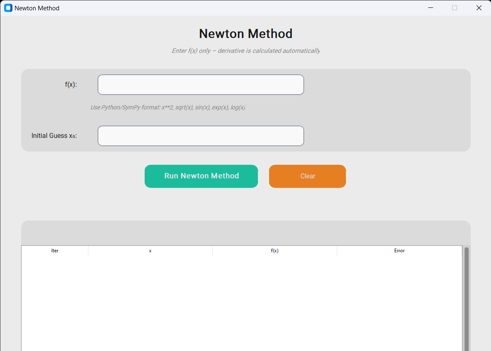
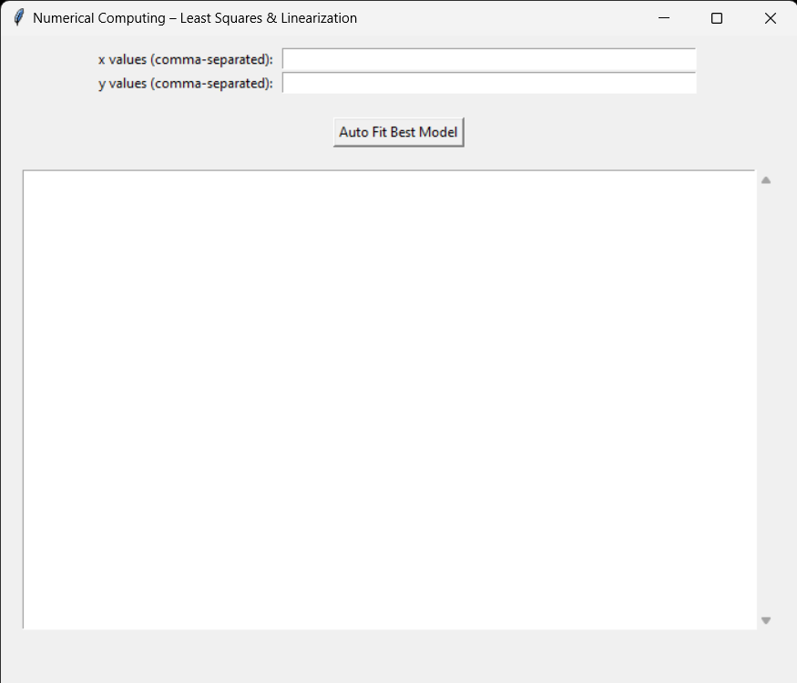

# 📐 Numerical Methods Project

This repository contains a collection of **Numerical Analysis methods** implemented in Python as part of a university project.  
The project provides **interactive GUIs** for each method and includes examples, iteration details, and results visualization.

---

## Project Overview

The project covers the following numerical methods:

1. **Newton–Raphson Method** – Root finding using derivative-based tangent line approximation.
2. **Secant Method** – Root finding without requiring derivatives.
3. **Jacobi Method** – Iterative solution for systems of linear equations.
4. **Linear Least Squares & Linearization** – Fits data to various models and selects the best using least squares.

Each method has its **own GUI**, **clear inputs and outputs**, and example usage to demonstrate functionality.

---

## 1️⃣ Newton–Raphson Method

> **Purpose:**  
> Find a root of a nonlinear equation using tangent-line approximation.  
> Ideal for functions where the derivative can be computed symbolically.

---

### 🔹 Mathematical Formula

$$
x_{n+1} = x_n - \frac{f(x_n)}{f'(x_n)}
$$

---

### 🖥 GUI Preview

  
*Interactive GUI allows input of function, initial guess, tolerance, and max iterations.*

---

### ⚙️ Inputs

- **Function**: Enter as a string in SymPy format, e.g., `x**2 - 2`  
- **Initial guess \(x_0\)**: Starting point for iterations  
- **Tolerance**: Default `1e-6`  
- **Maximum iterations**: Default `100`  

---

### 📊 Outputs

- **Approximate root**  
- **Iteration table** with: Iteration number, x, f(x), Error  
- **Symbolic derivative** f'(x)  
- **Convergence message** (success or failure)

---

### 🧪 Example Usage

```python
from newton_method import newton_method

# Define the function as a string
func_str = "x**3 - 2*x - 5"

# Initial guess
x0 = 2

# Run Newton Method
result = newton_method(func_str, x0)

# Print the approximate root
print("Root:", result["root"])

# Sample Output:  
Root: 2.094551  
Converged in 5 iterations
```

---

### ⚠️ Notes

- The derivative is calculated automatically; no need to enter manually.

- If the derivative at a point is zero, the method fails.

- Always check convergence for difficult functions.

---

## 2️⃣ Secant Method

> **Purpose:**  
> Find a root of a nonlinear equation without requiring derivatives.  
> Useful when derivative calculation is difficult or expensive.

---

### 🔹 Mathematical Formula

$$
x_{n+1} = x_n - f(x_n)\frac{x_n - x_{n-1}}{f(x_n) - f(x_{n-1})}
$$

---

### 🖥 GUI Preview

  
*Interactive GUI allows input of function, two initial guesses, tolerance, and max iterations.*

---

### ⚙️ Inputs

- **Function**: Enter as a string, e.g., `x**3 - 2*x - 5`  
- **Initial guesses \(x_0, x_1\)**: Two starting points  
- **Tolerance**: Default `1e-4`  
- **Maximum iterations**: Default `100`  

---

### 📊 Outputs

- **Approximate root**  
- **Iteration table** with: Iteration number, x0, x1, x2, f(x0), f(x1)  
- **Convergence message** (success or failure)

---

### 🧪 Example Usage

```python
from secant_method import secant_method

# Define the function
f = lambda x: x**3 - 2*x - 5

# Initial guesses
x0, x1 = 2, 3

# Run Secant Method
root, steps = secant_method(f, x0, x1)

print("Root:", root)

# Sample Output:
Root: 2.094551
Converged in 6 iterations
```
### ⚠️ Notes
- This method does not require the derivative.

- Convergence is not guaranteed; choose initial guesses carefully.

- Division by zero can occur if f(x1) - f(x0) = 0.

---

## 3️⃣ Jacobi Method

> **Purpose:**  
> Iteratively solves a system of linear equations \(Ax = b\).  
> Suitable for diagonally dominant or well-conditioned matrices.

---

### 🔹 Algorithm

For each iteration:

$$
x_i^{(k+1)} = \frac{1}{a_{ii}}\left(b_i - \sum_{j \ne i} a_{ij} x_j^{(k)} \right), \quad i=1,2,\dots,n
$$

Repeat until the solution converges within a specified tolerance.

---

### 🖥 GUI Preview

  
*GUI allows entry of matrix A, vector b, initial guess x0, tolerance, and max iterations.*

---

### ⚙️ Inputs

- **Matrix \(A\)**: Coefficient matrix  
- **Vector \(b\)**: Right-hand side  
- **Initial guess \(x_0\)**: Starting vector  
- **Tolerance**: Convergence criterion  
- **Maximum iterations**: Iteration limit  

---

### 📊 Outputs

- **Solution vector**  
- **Convergence message** (success or failure)

---

### 🧪 Example Usage

```python
import numpy as np
from jacobi_method import jacobi_method

A = np.array([
    [10, -1, 2, 0],
    [-1, 11, -1, 3],
    [2, -1, 10, -1],
    [0, 3, -1, 8]
])

b = np.array([6, 25, -11, 15])
x0 = np.zeros(4)

solution = jacobi_method(A, b, x0, tol=1e-6, max_iter=100)
print("Solution:", solution)

# Sample Output:
Solution: [1.0, 2.0, -1.0, 1.0]
Converged in 15 iterations
```
### ⚠️ Notes

- Convergence is guaranteed for diagonally dominant matrices.

- For non-diagonally dominant matrices, the method may fail to converge.

- Ensure matrix 𝐴 is square and consistent with vector b.

---

## 4️⃣ Linear Least Squares & Linearization

> **Purpose:**  
> Fits a set of data points to multiple models and selects the **best-fitting model** automatically using the **least squares criterion**.  
> Supports **linear, exponential, power, and growth rate models**.

---

### 🔹 Supported Models

| Model Type       | Formula                     | Linearized Form                  |
|-----------------|-----------------------------|---------------------------------|
| Linear           | $y = ax + b$               | $y = ax + b$                    |
| Exponential      | $y = b e^{ax}$             | $\ln(y) = ax + \ln(b)$          |
| Power            | $y = b x^a$                | $\ln(y) = a \ln(x) + \ln(b)$    |
| Growth Rate      | $y = \frac{ax}{b + x}$     | $\frac{1}{y} = \frac{b}{a}\frac{1}{x} + \frac{1}{a}$ |

---

### 🖥 GUI Preview

  
*Interactive GUI allows entry of x and y values, fits all supported models, and displays the best fit.*

---

### ⚙️ Inputs

- **x values**: Comma-separated numbers, e.g., `1,2,3,4`  
- **y values**: Comma-separated numbers, same length as x  

---

### 📊 Outputs

- **All tested models** with coefficients \(a, b\) and sum of squared residuals  
- **Best model** automatically selected based on minimum error  
- **Prediction results** can be computed using returned coefficients  

---

### 🧪 Example Usage

```python
from logic import auto_fit_best_model

x = [1, 2, 3, 4, 5]
y = [2.3, 4.5, 7.1, 9.0, 11.2]

result = auto_fit_best_model(x, y)

print("Best Model:", result["best_model"]["model"])
print("Coefficients: a =", result["best_model"]["a"], ", b =", result["best_model"]["b"])

# Sample Output:
Best Model: Linear: y = ax + b
Coefficients: a = 2.23 , b = 0.12
Sum of squared residuals = 0.05
```
### ⚠️ Notes

- Ensure all x and y values are numerical and of equal length.

- Exponential and power models require positive y values.

- Growth rate model requires non-zero x and y values.

- The method automatically selects the model with minimum sum of squared residuals.

---

## 👥 Team Members 

This project was developed collaboratively by the Numerical Computing course team.

| Name             | Role / Responsibility           |
|-----------------|---------------------------------|
| Ziad Bahaa Elsayed        | Newton Method   |
| Haitham Noor  | Secant Method                   |
| Hassan Ashraf  | Jacobi Method                   |
| Tarek Amr  | Gauss-Seidel Method             |
| Mohamed Ahmed  | Bisection Method                |
| Anas Mostafa  | False Position Method           |
| Mohamed Islam  | Linear Least Squares / Linearization |

> Each contributor is responsible for coding, testing, and documenting their assigned method.
